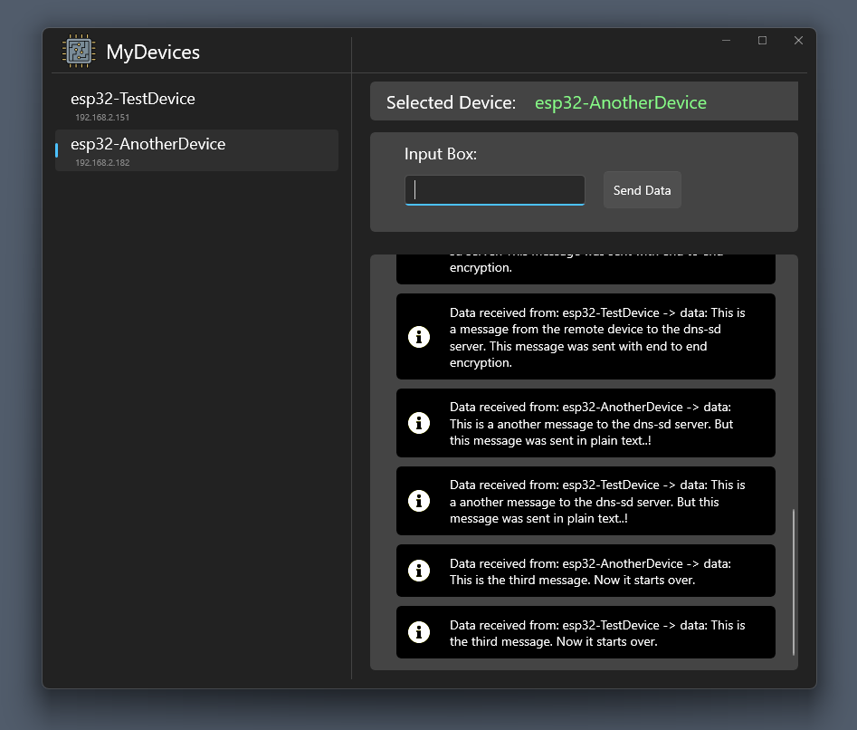
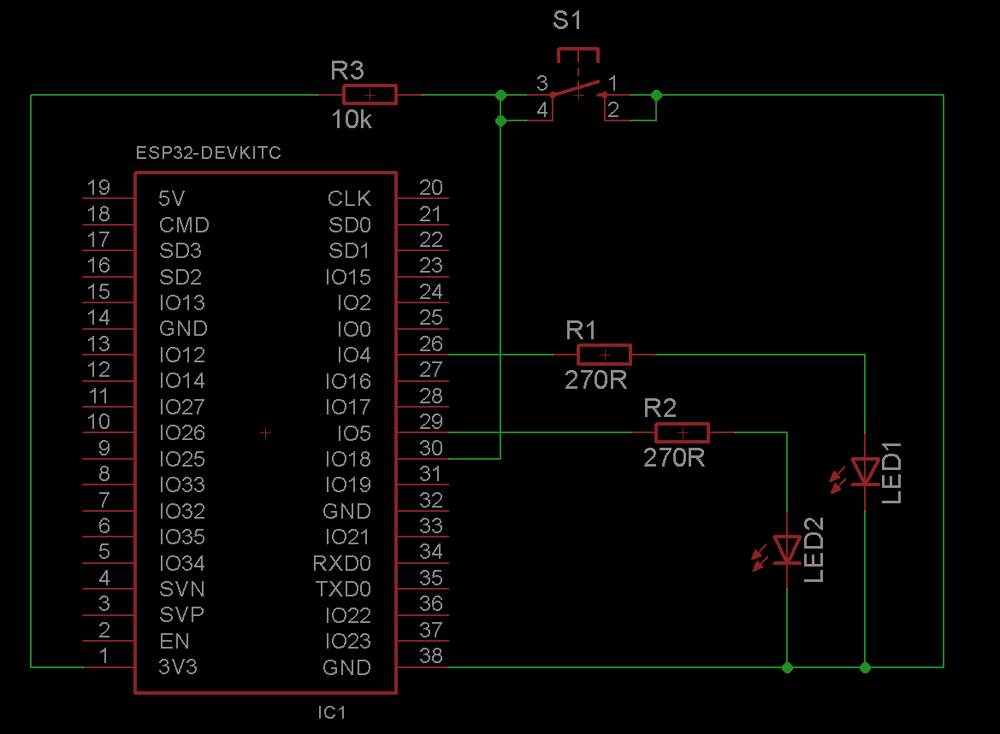

# DNS_SD_Device_Control

 Control remote devices with a central DNS-SD Server using encrypted data transmission on a local network.

 ### Key Features:
 - Encrypted data transmission using AES and RSA
 - Transmission control and error handling
 - Amount of remote devices only limited by the size of the subnet
 - A windows app called 'MyDevices' written in C# using .NET6 and WinUI 3
 - Esp32 firmware written in C++ using PlatformIO and the Arduino Framework

## Description

### Windows App
The Windows application creates a listener that listens for a TCP connection on a specified port on a local network. The remote device scans the local network for the service and connects to it. When a connection is received, a secure connection will be established by using the assymetric and symetric encryption technologies RSA and AES, respectively. The end to end encryption scheme is explained below. Transmission package control will be handled automatically including error handling of lost, corrupted or misleaded packages.

> **NOTE**
> The App is written in C# with Visual Studio 22. The .net6 framework is used combined with the WinUI3 UX platform.

### ESP32 (Client)
The client connects to the local network and scans for the specific service which is advertised by the server. Once the service is discovered, the client connects to it. Furthermore a secure connection will be established using symetric and assymetric encryption methods. The encryption scheme is explained below. An ESP32 microcontroller is used as the client in this project. The test circuit contains two LED and a hardware switch to show the status of the connections and to demonstrate functionality:

> **NOTE**
> The firmware project for the device is written in C++ with Visual Studio Code and PlatformIO

## End to End Encryption

Once a connection to a client is received, the app creates a RSA keypair for the current session per device. The public key is transmitted to the client. The client creates an AES key for the session, encrypt it with the RSA public key and sends it back to the app. There it is decrypted with the RSA private key. Now a secure data transmission can be done using the AES key.
The following illustration shows a schematic view of this process:

## Additional Information

> **IMPORTANT**
> The DNS-Service advertising will only work if the network settings of the computer are set to 'private network'. Otherwise other network participants cannot discover the service because the computer is hidden in the network.

## Attributions

Attributions for images that were used in this project:

<a href="https://www.flaticon.com/free-icons/local-area" title="local area icons">Local area icons created by Eucalyp - Flaticon</a> 
<a href="https://www.flaticon.com/free-icons/processor" title="processor icons">Processor icons created by Nuricon - Flaticon</a> 
<a href="https://www.flaticon.com/de/kostenlose-icons/detail" title="detail Icons">Detail Icons erstellt von surang - Flaticon</a> 
<a href="https://www.flaticon.com/free-icons/warning" title="warning icons">Warning icons created by Hilmy Abiyyu A. - Flaticon</a> 

